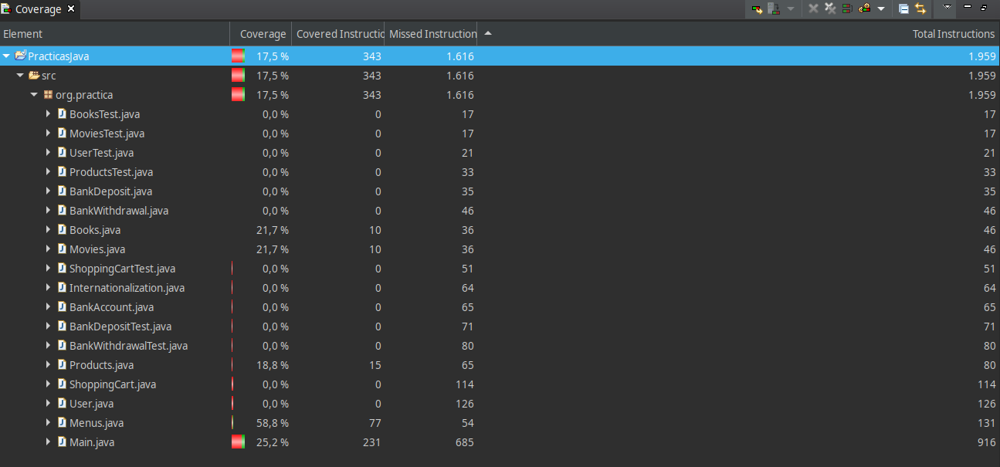
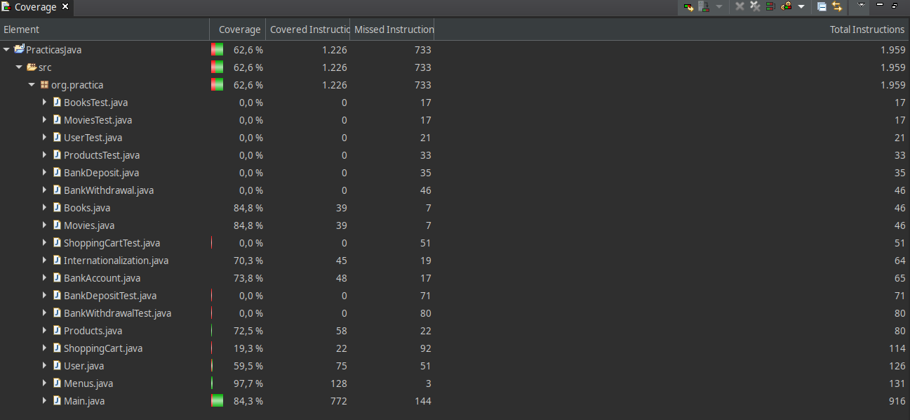

# INTRODUCTION
This is my repository where I have published my Advanced Programming Techniques (Java) Practices. It works like an online product library.

For the last practice, I have restructured and optimized the code. I have used an Eclipse extension, SonarLint, and also a code analyzer, Codacy. Each class has its own test to verify its correct functioning. In addition, internationalization is applied to all the messages in the code. Within functionality, the most remarkable things are that there are concurrence and patterns, inheritances and nested classes.

# CODE
The code consists of:
- Classes: BankAccount, BankDeposit, BankWithdrawal, Main, Menus, Products (Movies and Books), User, MathDiscount and ShoppingCart. It also has an Internationalization class to change the language (English or Spanish).
- Tests: BankDepositTest, BankWithdrawalTest, BooksTest, MoviesTest, ProductsTest, ShoppingCartTest and UserTest.
- Interfaces: InterfaceProducts and InterfaceUser.

I have created a concurrent process with the Thread class. To do this, I created two subclasses of Thread. In each subclass (BankDeposit and BankAccount) there is a run() method that executes a thread. Finally, for the test, the thread starts with a start() method and ends when the method comes to the end or executes a return statement.

# MAIN
If you run the program, a menu will appear on the console with five options: Log in, create, delete and shows users, and change the language. If you log in propertly, another menu will appear, this time with the products options, where you can search, borrow or return them. The user will have a balance to withdraw the products, and they will be saved in a shopping cart.  

I used a free code coverage tool, EclEmma, to bring the code coverage analysis. I have done two analysis: 
- First, at the beginning of the program execution:

- Second, at the end when the program have finished:

As you can see, as more code is executed, the coverage percentage increases.

Why sometimes we have to stop the development? This is to improve the interface or refactoring the code, due to make a simpler program for the user, improving it both visually and in time of execution, to do it more quickly.

That's all for now!

